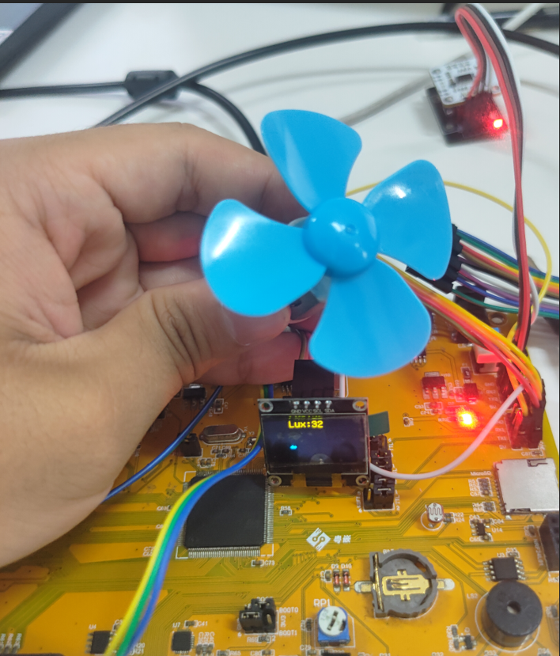
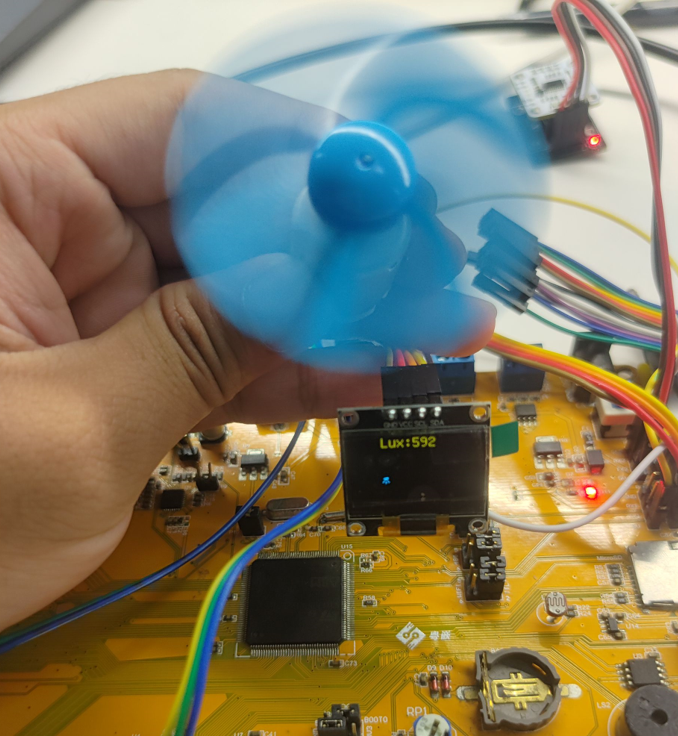
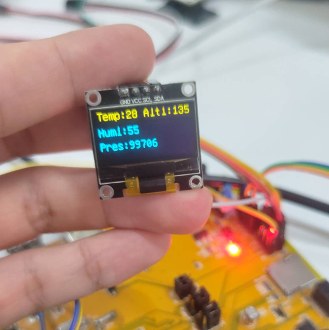

本项目以gy_39传感器为核心，通过其获取环境的参数以此为根据来实现对于其他外设的合理调控。

本项目将获取到的光照强度 Lux，空气湿度 %、环境温度 ℃ 、气压 Pa 、海拔 m 的数据显示在OLED屏幕上，OLED屏幕采用[U8g2第三方库](https://github.com/olikraus/u8g2.git)来实现字符的显示，根据光照强度是否超过阈值来切换电机的行动。

展示结果

